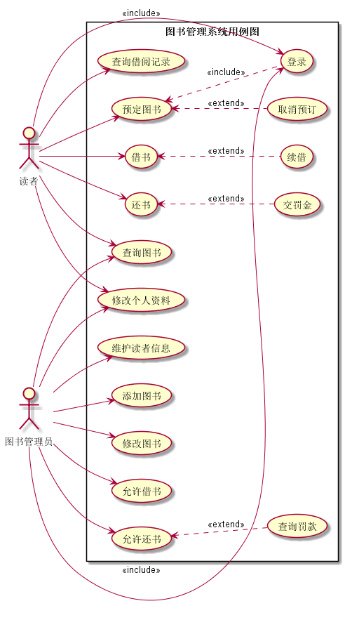
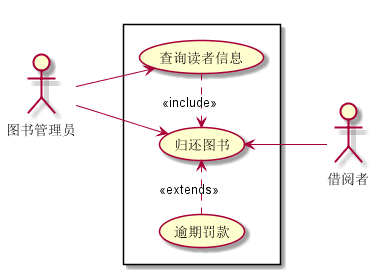
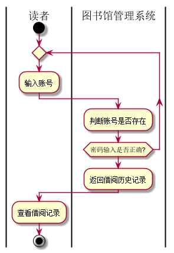
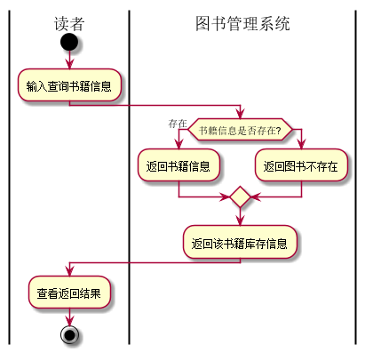
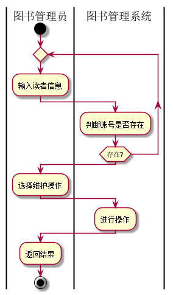

# 实验报告
学号|班级|姓名|
|:-------:|:-------------: | :----------:|
|201510414405|软件(本)15-4|胡硕明||

***

- - -
# 实验二：图书管理系统用例建模
## 1.图书管理系统的用例关系图
### 1.1用例图PlantUML源码如下：

```
 @startuml
 left to right direction
 skinparam packageStyle rectangle
 actor 读者 as d
 actor 图书管理员 as t

 rectangle 图书管理系统用例图{

     d --> (查询借阅记录)
     d --> (预定图书)
     (预定图书)<..(登录):<<include>>
     (预定图书)<..(取消预订):<<extend>>
     d --> (借书)
     (借书)<..(续借):<<extend>>
     d --> (还书)
     (还书)<..(交罚金):<<extend>>

     d --> (修改个人资料)
     d --> (查询图书)
     d --> (登录):<<include>>

     t --> (修改个人资料)
      t --> (维护读者信息)
     t --> (查询图书)
     t --> (登录):<<include>>
     t --> (添加图书)
     t --> (修改图书)
     t --> (允许借书)
     t --> (允许还书)
     (允许借书)<..(查询罚款):<<extend>>


 }
 @enduml
 ```
### 1.2用例图如下：



## 2.参与者说明
### 2.1 图书管理员
主要职责是：

- 维护系统，完善系统。
- 维护图书信息与读者的个人资料
- 及时检查图书管理系统是否有问题。
- 管理读者的借书、还书等操作。
- 对超时的借书用户进行罚款操作。
### 2.2 读者
主要职责是：
- 能有预订和取消预订图书权力
- 可以通过查询图书并借取或者归还图书。
- 可查询自己的借阅历史记录。
- 按时还书，否则或造成逾期罚款。
## 3.用例规约表


### 3.1 "查询个人资料"用例规约
|用例 | 内容 |
|:------:|:------:|
|用例名称|查询个人资料|  
|参与者|图书管理员、借阅者|
|前置条件|拥有读者或管理员账户，输入正确的帐号密码并登录|
|后置条件|登录信息正确，能够正常登录到个人页面|
|主事件流|系统返回个人信息主页，后台传输个人信息到页面上；
|备选事件流|1.帐号错误，提示用户<br>2.密码错误，提示用户<br>3.系统阻塞，提示管理员|
 ### 3.2 "归还图书"用例规约
 |Title | 内容 |
 |:------:|:------:|
 |用例名称|归还图书|  
 |参与者|图书管理员|
 |前置条件|登录图书管理员账号|
 |后置条件|显示图书可归还状态|
 |主事件流|1.判断账号是否存在；<br>2.查询用户借阅记录；<br>3.返回结果；<br>4.归还图书；<br>5.修改库存；


 ### 3.3“归还图书”用例流程图源码如下：
 ```
 @startuml
:图书管理员: as Admin
:借阅者: as User
left to right direction
rectangle {
Admin -->(归还图书)
Admin -->(查询读者信息)
(查询读者信息).>(归还图书):<<include>>
(逾期罚款).>(归还图书):<<extends>>
(归还图书) <--User
}
@enduml
 ```
### 3.3.1“归还图书”用例图如下：


### 3.4“查询借阅记录”用例流程图源码如下：
 ```
@startuml
|读者|
start
repeat
:输入账号;
	|图书馆管理系统|
	:判断账号是否存在;
repeat while (密码输入是否正确?)

:返回借阅历史记录;
|读者|
:查看借阅记录;

stop
@enduml
 ```
### 3.4.1“查询借阅记录”用例流程图如下：

### 3.5 "查询图书"用例规约
|用例 | 内容 |
|:------:|:------:|
|用例名称|查询个人资料|  
|参与者|读者|
|前置条件|拥有账户，并能正常登陆系统|
|后置条件|查询图书成功，返回查询图书结果页面|
|主事件流|1.输入图书信息<br>2.查询到该图书并返回信息；
|备选事件流|1.不存在该书籍<br>2.系统异常，无法显示|

### 3.5“查询图书”用例流程图源码如下：
 ```
@startuml
|读者|
start
	:输入查询书籍信息;
	|图书管理系统|
if(书籍信息是否存在?) then (存在)
	:返回书籍信息;
else
	:返回图书不存在;
endif
:返回该书籍库存信息;
|读者|
:查看返回结果;

stop
@enduml
 ```
### 3.5.1“查询借阅记录”用例流程图如下：


 ### 3.6 "维护读者信息"用例规约
 |Title | 内容 |
 |:------:|:------:|
 |用例名称|维护读者信息|  
 |参与者|图书管理员|
 |前置条件|登录图书管理员账号，返回管理读者页面|
 |后置条件|维护读者信息成功|
 |主事件流|1.查询到读者的个人信息；<br>2.进行相关的管理操作；<br>3.执行该操作；<br>4.返回操作结果;
 |备选事件流|1.不存在该读者账户<br>2.系统异常，无法显示|

 ### 3.6.1“维护读者信息”用例流程图源码如下：
 ```
@startuml
|图书管理员|
start
repeat
	:输入读者信息;
	|图书管理系统|
	:判断账号是否存在;
repeat while (存在?)
|图书管理员|
:选择维护操作;
|图书管理系统|
:进行操作;

|图书管理员|
:返回结果;

stop
@enduml
 ```
### 3.6.2“维护读者信息”用例图如下：

