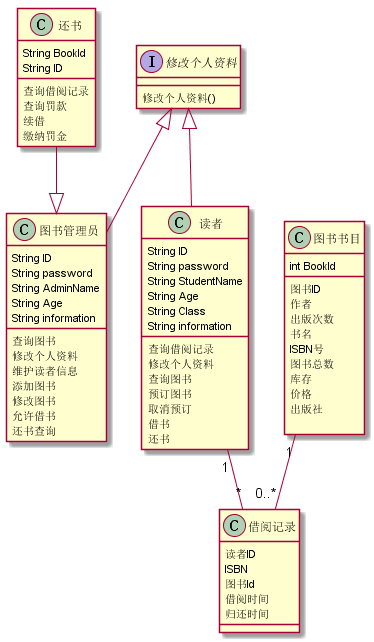
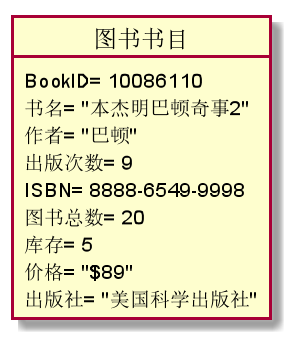
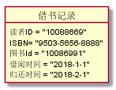
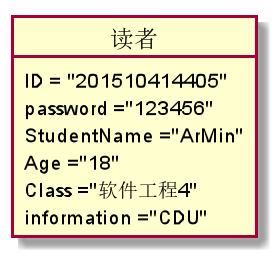
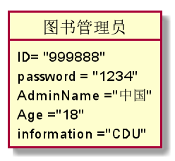
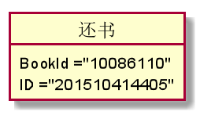

## 实验三：图书管理系统领域对象建模

|学号|班级|姓名|
|:---------------:|:------------:|:------------:|
|201510414405|软件15-4|胡硕明|

### 1.图书管理系统类图

**1.1PlantUML源码如下：**
~~~
@startuml

    interface 修改个人资料 {
    修改个人资料()
    }

	class 图书管理员 {
	    String ID
	 	String password
	 	String AdminName
	 	String Age
	 	String information
		 ____
		查询图书
		修改个人资料
        维护读者信息
		添加图书
		修改图书
		允许借书
		还书查询
	}
	class 还书{
	String BookId
	String ID
	___
	查询借阅记录
	查询罚款
	续借
	缴纳罚金
	}

	class 读者 {
	 	String ID
	 	String password
	 	String StudentName
	 	String Age
	 	String Class
	 	String information
		 ____
		查询借阅记录
		修改个人资料
		查询图书
		预订图书
		取消预订
	    借书
	    还书
	}

	class 图书书目 {
	int BookId
	__
	    图书ID
	 	作者
	 	出版次数
	 	书名
	 	ISBN号
	 	图书总数
	 	库存
	 	价格
	 	出版社

	}

	class 借阅记录 {
	 	读者ID
	 	ISBN
	 	图书Id
	 	借阅时间
	 	归还时间
	}

读者 "1" -- "*" 借阅记录
图书书目 "1" --"0..*"  借阅记录

	修改个人资料  <|-- 读者
	修改个人资料  <|-- 图书管理员
	还书 --|> 图书管理员

@enduml
~~~

**1.2类图如下：**

### 2.图书管理系统对象图

**2.1图书书目类的对象图**

**2.1.1PlantUML源码如下：**
~~~
@startuml

object 图书书目 {
                BookID= 10086110
                书名= "本杰明巴顿奇事2"
        	 	作者= "巴顿"
        	 	出版次数= 9
        	 	ISBN= 8888-6549-9998
        	 	图书总数= 20
        	 	库存= 5
        	 	价格= "$89"
        	 	出版社= "美国科学出版社"

}

@enduml
~~~

**2.1.2图书书目类对象图如下：**

**2.2类借阅记录对象图**

**2.2.1PlantUML源码如下：**
~~~
@startuml

object 借书记录 {
        读者ID = "10088669"
        	 	ISBN= "9503-5656-8888"
        	 	图书Id = "10086991"
        	 	借阅时间 = "2018-1-1"
        	 	归还时间 = "2018-2-1"
}

@enduml
~~~

**2.2.2对象图如下：**

**2.3读者类对象图**

**2.3.1PlantUML源码如下：**
~~~
@startuml

object 读者 {
		         ID = "201510414405"
         	 	 password ="123456"
         	     StudentName ="ArMin"
         	 	 Age ="18"
         	 	 Class ="软件工程4"
         	 	 information ="CDU"
}

@enduml
~~~

**2.3.2对象图如下：**

**2.4图书管理员类对象图**

**2.4.1PlantUML源码如下：**
~~~
@startuml

object 图书管理员 {
		    ID= "999888"
         	password = "1234"
         	AdminName ="中国"
         	Age ="18"
         	information ="CDU"
}

@enduml
~~~

**2.4.2图书管理员类对象图如下：**

**2.5还书类对象图**

**2.5.1PlantUML源码如下：**
~~~
@startuml

object 还书 {
		    	BookId ="10086110"
            	ID ="201510414405"
}

@enduml
~~~

**2.5.2还书类对象图如下：**

