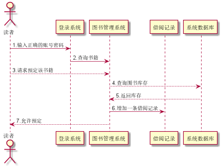

# 实验4：图书管理系统顺序图绘制
|学号|班级|姓名|照片|
|:-------:|:-------------: | :----------:|:---:|
|201510414405|软件(本)15-4|胡硕明|NULL

## 图书管理系统的顺序图

## 1. 修改个人资料用例
## 1.1. 修改个人资料用例PlantUML源码

``` @startuml
    
    actor 读者
    participant "登录系统"
    participant "系统数据库"
    
    读者 -> 登录系统:1：判断账号密码是否正确
    读者 <-- 系统数据库:2：返回个人信息数据
    
    
    登录系统 -> 系统数据库: 3.修改个人数据
    读者<-- 系统数据库 :4：返回结果
    
    @enduml
```

## 1.2. 修改个人资料用例顺序图


## 1.3. 修改个人资料用例顺序图说明
1.读者登陆到图书管理系统 
2.系统的数据库返回个人信息主页
3.读者在系统中修改个人数据
4.系统向数据库发送操作请求
5.数据库执行后向读者发送结果
***

## 2. 查询图书用例
## 2.1. 查询图书用例PlantUML源码

``` @startuml
    
    actor 读者
    participant "登录系统"
    participant "图书管理系统"
    participant "系统数据库"
    
    读者 -> 登录系统:1：判断账号密码是否正确
    读者 --> 图书管理系统:2:输入查询的该书籍信息
    
    
    图书管理系统 -> 系统数据库: 3.发送获取图书信息请求
    读者<-- 系统数据库 :4：返回结果
    
    @enduml
```

## 2.2. 查询图书用例顺序图


## 2.3. 查询图书用例顺序图说明
1.读者登陆到图书管理系统 
2.读者向图书管理系统发送获取某个书籍信息的请求
3.系统数据库向读者发送该书籍的相关信息
***

## 3.查询借阅记录用例
## 3.1. 查询借阅记录例PlantUML源码

``` @startuml
    
    actor 读者
    participant "登录系统"
    participant "图书管理系统"
    participant "系统数据库"
    
    读者 -> 登录系统:1：判断账号密码是否正确
    登录系统 --> 图书管理系统:2:查询借阅记录
    
    
    图书管理系统 -> 系统数据库: 3.发送获取借阅数据请求
    读者<-- 系统数据库 :4：返回该账户的借阅记录数据
    
    @enduml
```

## 3.2. 查询借阅记录用例顺序图


## 3.3. 查询借阅记录用例顺序图说明
1.读者登陆到图书管理系统 
2.读者向图书管理系统发送获取借阅记录的请求
3.系统向数据库发送获取数据的请求
4.数据库向读者返回该账户的借阅记录


***

## 4. 归还图书用例
## 4.1. 归还图书用例PlantUML源码

``` 
@startuml

actor 图书管理员
participant "登录系统"
participant "图书管理系统"
participant "借阅记录"
participant "系统数据库"

图书管理员 -> 登录系统:1：输入正确管理员账号密码
登录系统 -> 图书管理系统:2:获取该读者借阅信息


借阅记录 --> 图书管理员: 3.返回该读者借阅记录
图书管理员 --> 借阅记录: 4.允许还书
借阅记录 -> 系统数据库:5.修改图书库存
图书管理员 <-- 系统数据库:6.还书成功


@enduml
```

## 4.2. 归还图书用例顺序图


## 4.3. 归还图书用例顺序图说明
1.图书管理员登陆到图书管理系统 
2.管理员向图书管理系统发送获取读者借阅信息的请求
3.系统返回该读者借阅记录给管理员
4.图书管理员对数据库操作，修改图书库存
5.数据库返回操作结果

***

## 5. 借阅图书用例
## 5.1. 借阅图书用例PlantUML源码

``` 
@startuml
    
    actor 图书管理员
    participant "登录系统"
    participant "图书管理系统"
    participant "借阅记录"
    participant "系统数据库"
    actor "读者"
    
    
    读者 --> 登录系统:1：输入正确账号密码
    读者 --> 图书管理系统:2:申请借阅书籍
    
    
    图书管理员 <-- 图书管理系统: 3.处理读者借阅的申请信息
    图书管理员 --> 借阅记录: 4.允许借书
    借阅记录 -> 系统数据库:5.修改图书库存
    图书管理员 <-- 系统数据库:6.返回结果
    读者 <-- 借阅记录:7.借书成功
    
    
    @enduml
```

## 5.2. 借阅图书用例顺序图


## 5.3. 借阅图书用例顺序图说明
1.读者登陆到图书管理系统 
2.读者向图书管理系统发送申请借阅书籍的请求
3.系统返回处理申请请求给管理员
4.图书管理员向系统发送允许本次借阅操作
5.系统增加一条借阅记录，并修改数据库数据
6.向图书管理员返回本次操作结果
7.通知读者借书成功

***

## 6. 查询罚款用例
## 6.1. 查询罚款用例PlantUML源码

``` 
@startuml

actor 图书管理员
participant "登录系统"
participant "图书管理系统"
participant "借阅记录"


图书管理员 -> 登录系统: 1.输入正确的账号密码
图书管理员 <-- 图书管理系统: 2.返回管理员操作页面
图书管理员 -->借阅记录:3.请求返回借阅时间及罚金
图书管理员 <--借阅记录:4.返回时间记录及罚款金额


@enduml
```

## 6.2. 查询罚款用例顺序图


## 6.3. 查询罚款用例顺序图说明
1.图书管理员登陆到图书管理系统 
2.图书管理系统向管理员返回操作主页
3.管理员对系统发送获取某读者借阅记录与罚金的请求
4.系统返回借阅记录与罚金
***

## 7. 预定图书
## 7.1. 预定图书用例PlantUML源码

``` 
@startuml

actor 图书管理员
participant "登录系统"
participant "图书管理系统"
participant "借阅记录"


图书管理员 -> 登录系统: 1.输入正确的账号密码
图书管理员 <-- 图书管理系统: 2.返回管理员操作页面
图书管理员 -->借阅记录:3.请求返回借阅时间及罚金
图书管理员 <--借阅记录:4.返回时间记录及罚款金额


@enduml
```

## 7.2. 预定图书用例顺序图


## 7.3. 预定图书用例顺序图说明
1.读者登陆到图书管理系统 
2.查询某本书籍
3.读者对系统发送申请预定的请求
4.系统对数据库查询库存，是否满足预定条件
5.数据库返回库存
6.系统增加一条借阅记录
7.通知读者预定成功

***
