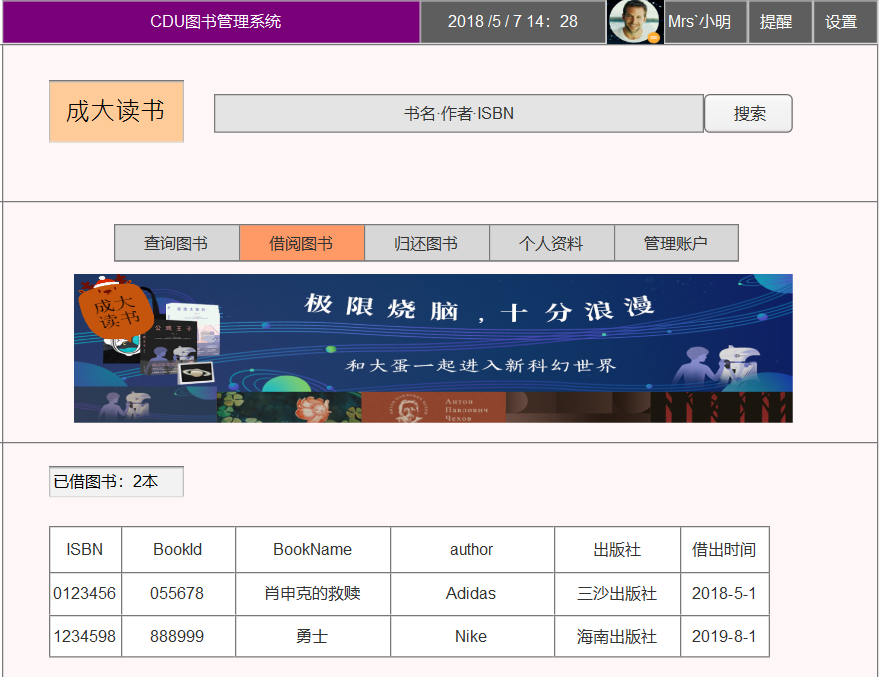

# 实验5：图书管理系统数据库设计与界面设计
|学号|班级|姓名|照片|
|:-------:|:-------------: | :----------:|:---:|
|201510414405|软件(本)15-4|胡硕明|[自带帅照]|

## 1.数据库表设计

## 1.1. 图书书目表
|字段|类型|主键，外键|可以为空|约束|说明|
|:-------:|:-------------:|:------:|:----:|:----:|:-----|
|ISBN|varchar(20)|主键|否| | 
|BookId|varchar(15)| |否|  |图书馆内部编号|
|author|varchar(80)| |否| |著作人|
|pubis_Num|int(20)| |否||
|BookName|varchar(100)| |否||||
|AllNum|int(100)| |否| |  图书总数|
|prices|double| |否| |     单本价格|
|publish|date| |否| |出版社|


## 1.2. 读者表

|字段|类型|主键，外键|可以为空|约束|说明|
|:-------:|:-------------:|:------:|:----:|:----:|:-----|
|ReaderId|varchar(20)|主键|否| | 
|password|varchar(20)| |否|  |读者的密码|
|ReaderName|varchar(20)| |否| |读者姓名|
|age|int(20)| |是| |年龄|
|Class|varchar(100)| |是| |所属班级|
|Information|varchar(100)| |是| |  个人简介|

## 1.3. 图书管理员表
|字段|类型|主键，外键|可以为空|约束|说明|
|:-------:|:-------------:|:------:|:----:|:----:|:-----|
|AdminId|varchar(20)|主键|否| | 
|password|varchar(20)| |否|  |管理员的密码|
|AdminName|varchar(20)| |否| |管理员姓名|
|age|int(20)| |是| |年龄|
|Information|varchar(100)| |是| |  个人简介|

## 1.4. 借阅记录表
|字段|类型|主键，外键|可以为空|约束|说明|
|:-------:|:-------------:|:------:|:----:|:----:|:-----|
|Lender_Id|varchar(20)|主键|否| | 借书人编号| 
|RederId|varchar(20)| |否|  |读者ID|
|ISBN|varchar(80)| |否| ||
|BookId|int(20)| |否||
|BookName|varchar(100)| |否||||
|Lend_Time|varchar(100)| |否| |  借阅时间|
|Retrun_Time|varchar(100)| |否| |  归还时间|
|forfeit|varchar(20)| |是| |  罚金|

## 1.5. 还书表


|字段|类型|主键，外键|可以为空|约束|说明|
|:-------:|:-------------:|:------:|:----:|:----:|:-----|
|Retrun_Id|varchar(20)|主键|否| | 归还编号| 
|RederId|varchar(20)| 外键|否|  |读者ID|
|BookId|int(20)| 外键|否||
|BookName|varchar(100)| |否||||
|ISBN|varchar(80)| |否| ||
|Set_Time|varchar(100)| |否| |  规定归还期限|
|forfeit|varchar(20)| |是| |  罚金|

***

## 2. 界面设计
## 2.1. 借阅图书界面设计

- 用例图参见：借阅图书用例
- 类图参见：图书书目类，借阅记录类，读者类
- 顺序图参见：借阅图书顺序图
- API接口如下：

1. 获取已借阅图书API

- 功能：用于获取读者所有已借图书
- 请求地址： http://localhost/test5/API/hushuoming
- 请求方法：GET
- 请求参数：

|参数名称|必填|说明|
|:-------:|:-------------: | :----------:|
|ReaderID|是|根据该读者ID找到已借阅的书籍 |
|method|是|固定为"Get" |

- 返回实例：
```
{
	"date": {
		"RederId": "2015104144xx",
		"ISBN": "0123457",
		"BookId": "abc123",
		"BookName": "肖申克的救赎",
		"Lend_Time": "2018-5-1",
		"Retrun_Time": null,
		"forfeit": null}, 
		{
      	"RederId": "2015104144xx",
      		"ISBN": "1234598",
      		"BookId": "abc569",
      		"BookName": "勇士",
      		"Lend_Time": "2099-8-1",
      		"Retrun_Time": null,
      		"forfeit": null
	}, 
	 "message": "获取成功"
	
}
```
- 返回参数说明：
    
|参数名称|说明|
|:-------:|:-------------: |
|date|获取该读者已借书籍|
|message|获取资源成功返回参数|

2. 查询图书API
- 功能：用于查询书籍相关信息
- 请求地址：http://localhost/test5/API2/hushuoming
- 请求方法：POST
- 请求参数：

|参数名称|必填|说明|
|:-------:|:-------------: | :----------:|
|ISBN|是|图书ISBN号 |
|BookId|是| 图书馆内部编号|
|method|是|固定为"POST" |


- 返回实例：
```
{
	"date": {
    		"ISBN": "0123459",
    		"BookId": "abc456",
    		"author": "苏长Ming",
    		"pubis_Num": "5",
    		"BookName": "suWorld",
    		"AllNum": 2
    		"prices": $45
    		"publisher": "海南出版社"
    		}, 
    		 
    	 "message": "获取成功"
}
```
- 返回参数说明：
    
|参数名称|说明|
|:-------:|:-------------: |
|date|获取查询的书籍相关信息|
|message|获取资源成功返回参数|


 