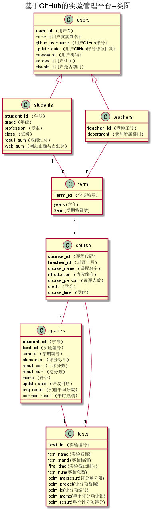

<!-- markdownlint-disable MD033-->
<!-- 禁止MD033类型的警告 https://www.npmjs.com/package/markdownlint -->

# 基于GitHub的实验管理平台的分析与设计

### 成都大学信息科学与工程学院

|学号|班级|姓名|照片|
|:-------:|:-------------: | :----------:|:---:|
|201510414405|软件(本)15-4|胡硕明||

## 1. 概述
- 基于GitHub的实验管理平台的作用是在线管理实验成绩的Web应用系统。学生和老师的实验内容均存放在GitHUB
页面上。
- 学生的功能主要有：

-       1.查看个人资料以及修改个人资料
        2.查看某个学期的课程成绩（只能查询自己的成绩）
        3.查看当前学期的可选课程
        4.查看某个学期的实验内容
        
- 老师的功能主要有：

-       1.查看个人资料以及修改个人资料
        2.维护自己任教的课程以（管理实验内容）
        3.查看学生成绩以及评定成绩
        4.查看当前学期可任教的课程
- 老师和学生都能通过本系统的链接方便地跳转到学生的每个GitHUB实验目录，以便批改实验或者查看实验情况。
- 实验成绩按每个单项成绩计算，计算出分项成绩总和为本次实验的总成绩，每项实验的满分为100分，最低为0分。
- 系统自动计算每个学生的所有实验的平均分。
    
## 2. 系统总体结构

界面设计参见：https://sun-s0.github.io/is_analysis/test6/ui/index.html
    
## 3. 用例图设计 [源码](src/WebUserCase.puml)

## 4. 类图设计 [源码](src/class.puml)

## 5. 数据库设计
- ### [参见数据库设计](./数据库设计.md)

## 6. 用例及界面详细设计
- ### [“登陆”用例](./用例/登陆.md),[界面](https://sun-s0.github.io/is_analysis/test6/ui/index.html)
- ### [“登出”用例](./用例/登出.md),[界面](https://sun-s0.github.io/is_analysis/test6/ui/index.html)
- ### [“查看个人资料”用例](./用例/查看个人资料.md),[界面-老师](https://sun-s0.github.io/is_analysis/test6/ui/%E6%9F%A5%E7%9C%8B%E4%B8%AA%E4%BA%BA%E8%B5%84%E6%96%99.html)  [界面-学生](https://sun-s0.github.io/is_analysis/test6/ui/%E6%9F%A5%E7%9C%8B%E4%B8%AA%E4%BA%BA%E8%B5%84%E6%96%99-%E5%AD%A6%E7%94%9F.html)
- ### [“修改个人资料”用例](./用例/修改用户信息.md),[界面-老师](https://sun-s0.github.io/is_analysis/test6/ui/%E4%BF%AE%E6%94%B9%E4%B8%AA%E4%BA%BA%E8%B5%84%E6%96%99.html)  [界面-学生](https://sun-s0.github.io/is_analysis/test6/ui/%E4%BF%AE%E6%94%B9%E4%B8%AA%E4%BA%BA%E8%B5%84%E6%96%99-%E5%AD%A6%E7%94%9F.html)
- ### [“修改密码”用例](./用例/修改密码.md),[界面-老师](https://sun-s0.github.io/is_analysis/test6/ui/%E4%BF%AE%E6%94%B9%E5%AF%86%E7%A0%81.html)  [界面-学生](https://sun-s0.github.io/is_analysis/test6/ui/%E4%BF%AE%E6%94%B9%E5%AF%86%E7%A0%81-%E5%AD%A6%E7%94%9F.html)
- ### [“学生列表”用例](./用例/学生列表.md),[界面-老师](https://sun-s0.github.io/is_analysis/test6/ui/%E5%AD%A6%E7%94%9F%E5%88%97%E8%A1%A8.html)  [界面-学生](https://sun-s0.github.io/is_analysis/test6/ui/%E5%AD%A6%E7%94%9F%E5%88%97%E8%A1%A8-%E5%AD%A6%E7%94%9F.html)
- ### [“查看成绩”用例](./用例/查看成绩.md),[界面-学生](https://sun-s0.github.io/is_analysis/test6/ui/%E6%9F%A5%E8%AF%A2%E6%88%90%E7%BB%A9.html)
- ### [“评定成绩”用例](./用例/评定成绩.md),[界面-老师](https://sun-s0.github.io/is_analysis/test6/ui/%E8%AF%84%E5%AE%9A%E6%88%90%E7%BB%A9.html)
- ### [“选择学期”用例](./用例/选择学期.md),[界面-老师](https://sun-s0.github.io/is_analysis/test6/ui/%E6%9F%A5%E7%9C%8B%E5%BD%93%E5%89%8D%E5%AD%A6%E6%9C%9F.html)  [界面-学生](https://sun-s0.github.io/is_analysis/test6/ui/%E6%9F%A5%E8%AF%A2%E6%88%90%E7%BB%A9.html)
- ### [“实验内容”用例](./用例/实验内容.md),[界面-学生](https://sun-s0.github.io/is_analysis/test6/ui/%E6%9F%A5%E7%9C%8B%E5%AE%9E%E9%AA%8C%E5%86%85%E5%AE%B9-%E5%AD%A6%E7%94%9F.html)
- ### [“管理实验”用例](./用例/管理实验.md),[界面-老师](https://sun-s0.github.io/is_analysis/test6/ui/%E7%BB%B4%E6%8A%A4%E5%AE%9E%E9%AA%8C%E5%86%85%E5%AE%B9.html)
- ### [“选课”用例](./用例/选课.md),[界面-老师](https://sun-s0.github.io/is_analysis/test6/ui/%E7%BD%91%E4%B8%8A%E9%80%89%E8%AF%BE.html) [界面-学生](https://sun-s0.github.io/is_analysis/test6/ui/%E7%BD%91%E4%B8%8A%E9%80%89%E8%AF%BE-%E5%AD%A6%E7%94%9F.html)

    
    
