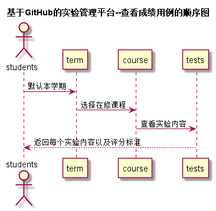

<!-- markdownlint-disable MD033-->
<!-- 禁止MD033类型的警告 https://www.npmjs.com/package/markdownlint -->

# “查看实验内容”用例 [返回](../README.md)
## 1. 用例规约

|用例名称|查看成绩|
|-------|:-------------|
|功能|学生可以查看该门课程的实验内容，以及各个实验的评分标准，提交实验的截止时间|
|参与者|学生|
|前置条件|学生需要先登录|
|后置条件|学生必须有选修的课程，且该课程有实验内容|
|主事件流| 1.选中课程管理菜单中—学期实验内容（默认为当前学期）2.系统返回当前学期在修课程3.选择要查看的课程 4.系统返回课程实验内容|
|备选事件流| |

## 2. 业务流程（顺序图） [源码](../src/sequence查看实验内容.puml)
 

## 3. 界面设计
- 界面参照: https://zwdbox.github.io/is_analysis/test6/ui/查看成绩.html
- API接口调用
    - 接口1：[getTestContent](../接口/getTestContent.md) 

## 4. 算法描述
    无
    
## 5. 参照表
- [STUDENTS](../数据库设计.md/#STUDENTS)
- [TERM](../数据库设计.md/#TERM)
- [GRADES](../数据库设计.md/#GRADES)
- [TESTS](../数据库设计.md/#TESTS)
