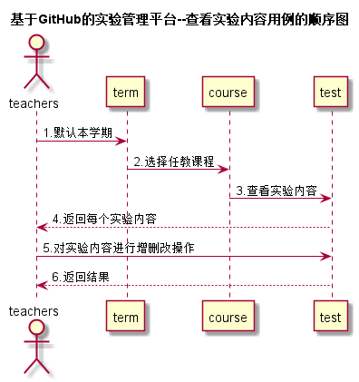

<!-- markdownlint-disable MD033-->
<!-- 禁止MD033类型的警告 https://www.npmjs.com/package/markdownlint -->

# “管理实验”用例 [返回](../README.md)
## 1. 用例规约

|用例名称|管理实验|
|-------|:-------------|
|功能|老师可以查看该门课程的实验内容，并对实验内容进行编辑和截止日期的设置，以及对实验内容增删操作|
|参与者|老师|
|前置条件|老师需要先登录系统|
|后置条件|老师拥有任教该门课程的权限|
|主事件流| 1.选中课程管理菜单中—当前任教课程2.系统返回当前学期任教课程3.选择需要管理实验内容的课程 4.选择子菜单中的"维护实验内容"5.系统调用查看实验的接口，获取已存储的实验内容6.对实验内容进行增删改操作，并保存提交。7.系统返回存储结果。|
|备选事件流| |

## 2. 业务流程（顺序图） [源码](../src/sequence管理实验.puml)
 

## 3. 界面设计
- 界面参照: https://zwdbox.github.io/is_analysis/test6/ui/查看成绩.html
- API接口调用
    - 接口1：[getTestContent](../接口/getTestContent.md) 
    - 接口2：[setTestContent](../接口/setTestContent.md) 

## 4. 算法描述
    无
    
## 5. 参照表
- [TERM](../数据库设计.md/#TERM)
- [COURSE](../数据库设计.md/#COURSE)
- [TEACHERS](../数据库设计.md/#TEACHERS)
- [GRADES](../数据库设计.md/#GRADES)
- [TESTS](../数据库设计.md/#TESTS)
