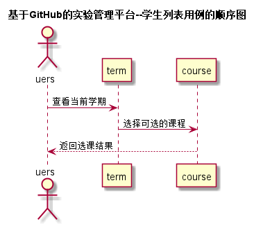

# “选课”用例 [返回](../README.md)

## 1. 用例规约

|用例名称|选课|
|-------|:-------------|
|功能|老师选择本学期可任教的课程，学生选择本学期可读课程|
|参与者|学生，老师|
|前置条件|登陆系统，选择网上选课模块|
|后置条件|学生选课必须是在老师选课结束后，确保学生选的课程有老师授课|
|主事件流| 1. 网上选课 2.用户为教师的从可选课程中选择自己的想任教的课程(学生也是选可选课程) 3.保存并提交数据 4.返回数据库存储结果
|备选事件流|1a. 保存失败  &nbsp;&nbsp; 1.提示重新进入系统选课    |

## 2. 业务流程 [源码](../src/sequence选课.puml)
 

## 3. 界面设计
- 界面参照 1: [选课界面（老师）](../ui/tea_select_course.html)
- 界面参照 2: [选课界面（学生）](../ui/stu_select_course.html)
- API接口调用
    - 接口1：[SelectCourse](../接口/SelectCourse.md)

## 4. 算法描述 
- 无
    
## 5. 参照表

- [USERS](../DesignDatabase.md/#USERS)
- [TERM](../数据库设计.md/#TERM)
- [COURSE](../DesignDatabase.md/#COURSE)
- [STUDENTS](../DesignDatabase.md/#STUDENTS)
- [TEACHERS](../DesignDatabase.md/#TEACHERS)