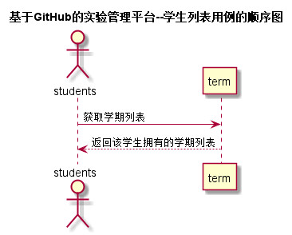

# “选择学期”用例 [返回](../../README.md)

## 1. 用例规约

|用例名称|选择学期|
|-------|:-------------|
|功能|学生选择某个在读学期|
|参与者|学生|
|前置条件| 用户为学生登陆系统|
|后置条件|使用课程管理模块中的"查询成绩"|
|主事件流| 1. 学生选中课程管理 2.点击网上选课 3.选中某一个显示的学期 4.返回该学期内的课程列表以及其他信息|
|备选事件流|无|

## 2. 业务流程[源码](../src/sequence选学期.puml)
 

## 3. 界面设计
- 界面参照: 
- API接口调用
    - 接口：[SelectTerm](../接口/SelectTerm.md)

## 4. 算法描述 
无
    
## 5. 参照表
- [TERM](../数据库设计.md/#TERM)
- [USERS](../DesignDatabase.md/#USERS)
- [STUDENTS](../数据库设计/数据库设计.md/#STUDENTS)